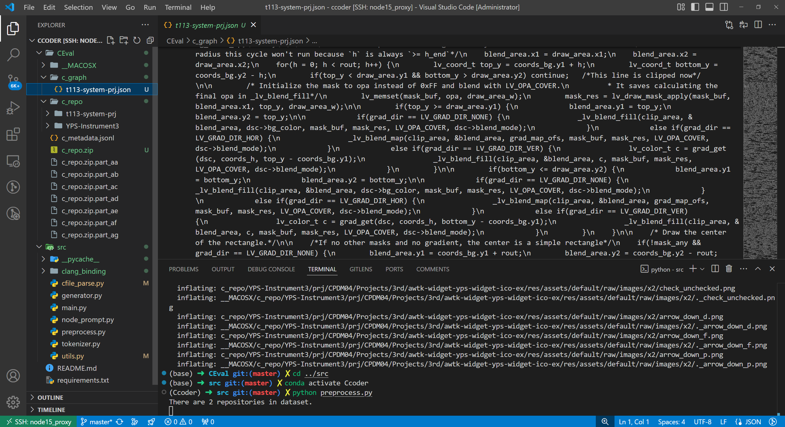

C 语言图提取并生成模型提示词
================================

简介
----

该模块专注于 C 语言的静态/半静态分析，能够从 C 源码中提取抽象语法树（AST）、控制流图（CFG）、数据流依赖图（DFG）等结构化信息，并将其转换成适用于语言模型的提示词（prompt）或结构化特征（structured features）,解决了语言模型分析代码时缺少 **上下文 （Context）** 的问题。

该模块的工作流程可以分为两个主要阶段：

阶段一：项目分析与上下文图谱构建 (Preprocessing)
^^^^^^^^^^^^^^^^^^^^^^^^^^^^^^^^^^^^^^^^^^^^^^^^^^^^^^^^^^^^^^^^^^^

这个阶段的目标是“学习”整个 C 语言项目的代码结构，并建立一个知识库（或者叫“上下文图谱”）。

1. **扫描项目文件** (``preprocess.py``): 程序首先会扫描指定 C 项目目录下的所有 ``.c`` 和 ``.h`` 文件。

2. **逐文件解析** (``cfile_parse.py``): 它使用 clang（一个 C/C++/Objective-C 的编译器前端）来对每个文件进行语法分析。这不仅仅是读取文本，而是构建了一个抽象语法树 (AST)，从而能精确地识别出：
   
   - 函数定义、变量声明、结构体（Struct）、联合体（Union）、枚举（Enum）等。
   - 它们在文件中的具体位置（行号）。
   - 它们之间的关系，例如一个变量是什么类型，一个函数返回什么类型。
   - 文件之间的 #include 关系。

3. **建立关系并存储** (``preprocess.py``): 解析完所有文件后，程序会处理这些信息，特别是本地头文件引用（#include "..."）。它会把所有文件的解析结果整合成一个大的 JSON 文件，这个文件就代表了整个项目的“上下文图谱”。

阶段二：针对性提示生成 (Prompt Generation)
^^^^^^^^^^^^^^^^^^^^^^^^^^^^^^^^^^^^^^^^^^^^^^^^^^^^^^^^^^^^^^^

当你需要对某个文件中的某段代码进行补全时，就进入了这个阶段。

1. **加载上下文** (``generator.py``): 程序会加载在第一阶段为该项目生成的上下文图谱 JSON 文件。
2. **分析当前代码** (``generator.py``): 它会分析你需要补全的代码片段（在 ``main.py`` 中称为 ``input``），特别是代码中的 ``#include "..."`` 语句。
3. **检索相关信息** (``node_prompt.py``): 根据 ``#include`` 的头文件，程序会从上下文图谱中精确地检索出这些头文件中定义的函数声明、结构体等关键信息。它通过一个深度优先搜索（DFS）来查找所有相关的依赖。
4. **构建提示** (``generator.py``, ``node_prompt.py``): 它将检索到的上下文信息（比如其他文件的函数定义）格式化，并放在一个特殊的注释块 ``/* ... */`` 中。
   
5. **智能截断与格式化 (tokenizer.py)**:
   
   - 不同的语言模型有不同的输入长度限制（Token Limit）。这个模块会根据你选择的模型（如 CodeLlama, GPT-4），精确计算提示和源代码的 token 数量。
   - 如果总长度超出了模型的限制，它会用一种智能的方式进行截断（比如优先保留代码补全点附近的代码，并从开头截断上下文信息），确保最有价值的信息被保留下来。
   - 最后，它将 **上下文注释、文件路径信息和待补全的代码** 拼接成一个最终的、可以直接输入给语言模型的提示。

**总结**：这个项目的本质是一个 **上下文感知的提示工程师（Context-Aware Prompt Engineer）** 。它通过静态分析整个 C 项目，为特定的代码补全任务，动态地构建一个包含最相关上下文的、为特定模型优化过的提示。

功能展示
--------

- 支持基于 clang/LLVM 的 AST 提取。
- 生成 CFG/DFG 并提取关键路径或影响集合。
- 将图结构序列化为模型友好的格式（例如结构化概率矩阵、edge-list、flat prompt + metadata）。

展示示例（伪代码）
^^^^^^^^^^^^^^^^^^^^^^^^^^^^^^^

.. code-block:: python

   from ncc.tools.c_graph import CGraphExtractor

   g = CGraphExtractor.parse_file("example.c")
   summary = CGraphExtractor.graph_to_prompt(g, focus_function="foo")
   # 将 summary 作为 prompt 输入到模型

演示图片
^^^^^^^^^^^^^^^^^^^^^^^^^^^^^^^
   

使用教程
--------

1. 依赖：需要安装 clang / libclang（并配置 LD_LIBRARY_PATH 或类似变量）。
2. 运行提取：
   
   .. code-block:: shell

      python -m ncc.tools.c_graph --file example.c --out example_graph.json

3. 将 graph JSON 转换为 prompt：
   
   .. code-block:: python

      from ncc.tools.c_graph import graph_to_prompt
      prompt = graph_to_prompt("example_graph.json", focus="foo")

准备环境
^^^^^^^^^^^^^^^^^^^^^^^^

.. code-block:: bash

   conda create -n Ccoder python=3.10
   pip install -r requirements.txt

CEval 数据集
_____________________________________

每个样本在CEval (``CEval/c_metadata.jsonl``) 包含以下字段：

- ``id``: 任务ID
- ``pkg``: 所属仓库
- ``fpath``: 待补全代码的文件路径
- ``input``: 待补全位置前的代码内容
- ``gt``: 待补全代码行的真实值

合并c_repo：

.. code-block:: bash

   cd CEval && cat c_repo.zip.part_* > c_repo.zip

快速开始
___________________

仓库特定的上下文图
*******************************

在离线预处理阶段，我们为数据集中的每个仓库构建仓库特定的上下文图：

.. code-block:: bash

   cd src && python preprocess.py

代码补全
*****************

在实时代码补全中，我们生成用于查询代码语言模型(LMs)的提示：

.. code-block:: bash

   cd src && python main.py --model $MODEL --file $OUT_FILE --c_dataset $DATASET