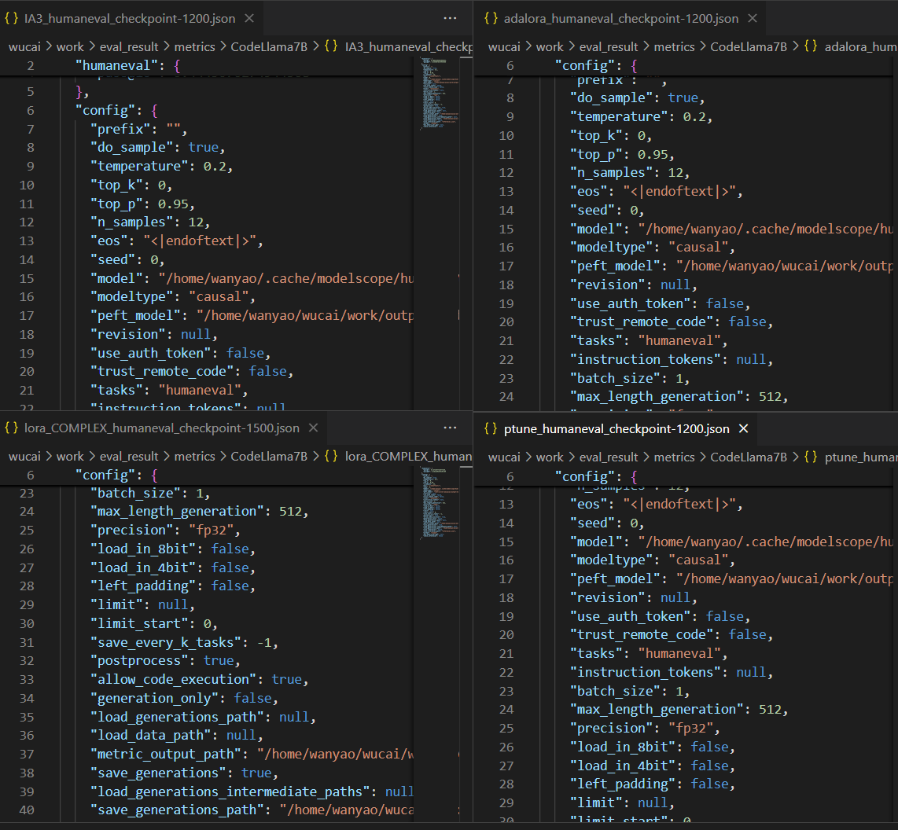

代码语言模型指令微调
==========================

简介
----

本模块用于对代码语言模型做指令式微调（Instruction Fine-tuning），使模型更好地遵循自然语言的指令（例如“给出函数注释”、“补全 TODO” 等）并提升交互式代码生成/修改能力。
其核心功能是通过提供标准化的数据集处理工具和可配置的训练脚本，对影响模型性能的关键变量进行量化对比和分析。框架旨在帮助研究人员和开发者找到最优的指令微调策略。

具体流程
^^^^^^^^^^^^^

1. **对比实验：指令数据格式的影响**
   
   框架的核心功能之一是深入探究训练数据对模型最终效果的影响。通过运行 ``instruction_data_compare.py`` 脚本，可以对以下数据维度进行受控实验：

   - **代码注释的价值分析**: 通过对比标准数据集与移除了代码注释的数据集，量化评估注释中的自然语言信息对模型学习代码逻辑的贡献度。
   - **思维链（CoT）的有效性验证**: 对比增加思维链（Chain of Thought）前后的模型表现，验证 CoT 在代码任务中引导模型进行逻辑推理的实际效果。
   - **思维链的复杂度研究**: 在使用 CoT 的基础上，进一步将思维链划等级，精细化地研究不同详细程度的推理步骤对模型性能的影响。

2. **对比实验：高效微调（PEFT）方法的影响**
   
   框架通过 peft_compare.py 脚本，支持在完全相同的数据集上对多种主流的参数高效微调（PEFT）技术进行对比实验，以评估其在代码任务上的性价比和最终效果。支持的 PEFT 方法包括：

   - **LoRA**
   - **AdaLoRA**
   - **Prefix-Tuning**
   - **P-Tuning**
   - **Prompt-Tuning**

3. **自动化的数据处理与生成**
   
   为了支撑上述对比实验，框架提供了一套强大的数据预处理工具，位于 ``data_process`` 文件夹下，能够自动化地生成实验所需的各种数据集。

   - **多维度 CoT 数据生成** (``CoT_complex_data_generate.py``): 利用一个强大的基座模型（如 Qwen2.5-72B），构建出用于复杂度对比实验的数据。
   - **数据集清洗工具** (``remove_comment_util.py``): 提供一键移除数据集中所有代码注释的功能，快速生成用于对照实验的数据集。

功能展示
--------

- 将任务数据（instruction, input, output）格式化为训练样本。
- 支持常见的训练流水线（数据并行、分布式训练、混合精度）。
- 提供验证/评估脚本（基于 BLEU / ROUGE / pass@k / 人工示例集等）。

示例配置（简要）
^^^^^^^^^^^^^^^^^^^^^^^^^^

.. code-block:: json

   {
     "model": "codellama-7b",
     "train_data": "data/instructions/train.jsonl",
     "batch_size": 8,
     "lr": 2e-5
   }

演示图片
^^^^^^^^^^^^^^^^^^^^^^^^^^

1. 支持对多种高效微调方法进行分析及能力对比
   

使用教程
--------

1. 数据准备：将数据组织为（instruction, input, output）三元组，推荐 JSONL。
2. 启动训练：
   
   .. code-block:: shell

      CUDA_VISIBLE_DEVICES=0,1 python -m ncc.train.instruction_finetune -c config/if_config.json

3. 验证与导出：训练完成后运行评估脚本并导出 checkpoint。

数据处理与增强
^^^^^^^^^^^^^^^^^^

- 项目提供 ``data_process`` 模块，用于生成和处理指令微调训练数据。
- ``CoT_complex_data_generate.py``：对带有复杂思维链（CoT）的训练数据进行简化，生成不同复杂度的思维链数据：
  
  - ``normal_think_step``：正常复杂度
  - ``simple_think_step``：简化后的思维链

- ``remove_comment_util.py``：可选地去除代码注释信息，研究注释对微调效果的影响。
- 支持分批处理大规模数据，并自动保存为 JSONL 格式。

指令微调实验
^^^^^^^^^^^^^^^^^^

- 使用 ``InstructionTrainer`` 类对基础模型进行指令微调。
- 实验主要包括：
  
  - 标准种子数据集微调
  - 去除注释的指令数据微调
  - 带有思维链信息的数据微调
  - 不同复杂度（简单 / 正常 / 复杂）的思维链数据微调

- 通过 YAML 配置文件(``configs/training/instruction_finetune.yaml``, ``configs/training/peft.yaml``)管理训练参数。

高效微调方法比较
^^^^^^^^^^^^^^^^^^

- 使用 ``peft_compare.py`` 比较不同高效微调方法（PEFT）对模型性能的影响：
  
  - LoRA
  - AdaLoRA
  - Prefix Tuning
  - P-tuning
  - Prompt Tuning

- 所有方法均使用相同的标准指令数据集进行微调，以保证可比性。

训练与实验流程
^^^^^^^^^^^^^^^^^^

配置环境变量：

.. code-block:: bash

   export PYTHONPATH="${PYTHONPATH}:/path/to/naturalcc/ncc"

运行微调脚本：

.. code-block:: bash

   python instruction_data_compare.py   # 或 peft_compare.py

脚本会读取指定数据集，自动进行训练，并生成微调后的模型。