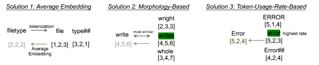
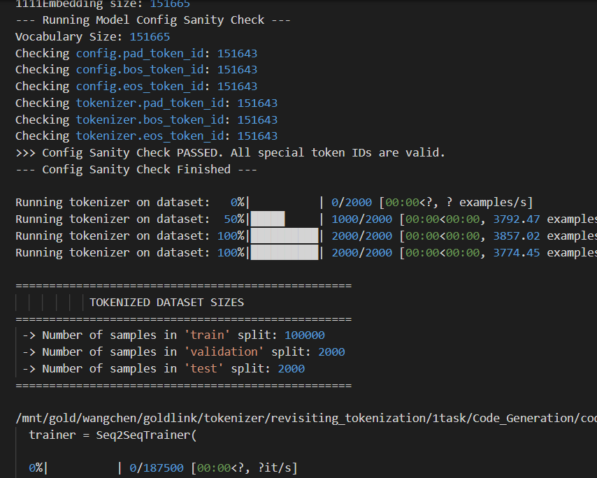
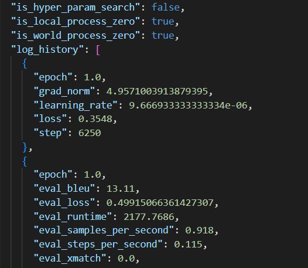

Tokenizer 自定义与评估工具箱
====================================

简介
----
本模块是一个面向代码语言模型的 **Tokenizer 自定义与评估工具箱**。它提供了一整套从训练新词表、迁移至现有模型，到在下游任务中进行端到端评测的完整解决方案。该工具类的核心是赋予开发者修改和优化模型“输入端”的能力，通过定制化的 Tokenizer 提升模型在特定领域（尤其是代码相关任务）的性能。

本项目支持对现有 tokenizer 的改造、训练新的 tokenizer 以及自定义 tokenizer 的实验与评估。项目结构清晰，模块化设计，适用于现代大模型训练场景，支持多卡并行、精度加速等优化。
Tokenizer 工具箱提供自定义分词器（Tokenizer）训练、词表管理、以及评估套件，用于验证不同 Tokenizer 在代码任务上的表现（如对代码片段的分割、subtoken 频率、OOV 率等）。

主要功能
^^^^^^^^^^^^^

1. **核心模块：Tokenizer 自定义与迁移**
   
   项目通过 ``modules`` 目录提供了一系列强大工具，支持对 Tokenizer 进行多种深度改造：

   - **词表构建与迁移** (``vocabulary_transfer``):  这是工具箱的中心功能。允许用户使用自己的语料库从零开始 **训练一个全新的词表** (``train_vocab.py``)。更关键的是，它提供了 **词表迁移** (``transfer.py``) 功能，能够将这个新词表无缝地整合进一个已有的预训练大模型中，解决了自定义 Tokenizer 后续模型适配的难题。
   - **Token 语义提取** (``token_semantics``): 针对特定任务（如代码生成、代码总结），此模块能够从原始数据中提取与 Token 相关的语义信息，为下游任务的训练准备格式化的输入数据。
   - **Token 结构微调** (``token_affix``): 提供对 Token 前后缀等细节进行处理和映射的工具，为实现更精细化的 Tokenizer 结构调整提供了可能。

2. **任务驱动的实验与评估**：
   
   本项目内置了完整的实验与评估流程：

   - **内置下游任务** (``experiments/tasks``): 提供了 **代码生成（Code_Generation）和代码总结（Code_Summarization）** 两个典型的代码领域任务。用户在定制完 Tokenizer 后，可以直接运行这些脚本来端到端地评测其对模型性能的实际影响。
   - **现代化训练脚本**: 所有实验脚本（如 ``run_modern.py``）都支持多 GPU 并行训练和混合精度加速，能够充分利用现代硬件，大幅缩短实验周期。
   - **独立的 Tokenizer 评估** (``evaluate``): 除了下游任务评测，项目还提供了独立的 Tokenizer 性能评估模块。通过 ``compute_metrics.sh`` 脚本，可以计算新 Tokenizer 的词表覆盖率、语义保持能力等固有指标，进行更全面的分析。

功能展示
--------

- 基于 BPE / SentencePiece / Unigram 的 Tokenizer 训练。
- 支持合并自定义 token（例如常见 API 名称、宏名）。
- 提供评估指标：token 长度分布、平均序列长度、OOV 比率、下游任务影响评估（可选）。

演示图片
^^^^^^^^^^^^^^^^^^^^^^^^^^

1. Tokenizer 自定义功能介绍
   

2. 支持对 Tokenizer 进行自定义及微调实验
   

3. 支持对自定义 Tokenizer 能力进行完整评估
   

使用教程
--------

1. 训练 Tokenizer（示例，SentencePiece）：
   
   .. code-block:: shell

      python -m ncc.tools.tokenizer.train --input data/code_corpus.txt --model_prefix my_tokenizer --vocab_size 50000

2. 应用 Tokenizer：
   
   .. code-block:: python

      from ncc.tools.tokenizer import load_tokenizer
      tok = load_tokenizer("my_tokenizer.model")
      tokens = tok.encode("int foo(int a) { return a+1; }")

3. 评估：
   
   .. code-block:: shell

      python -m ncc.tools.tokenizer.evaluate --model my_tokenizer.model --dataset data/val_code.txt --out report.json

环境配置
^^^^^^^^^^^^^^^^^^
1. 创建虚拟环境

.. code-block:: bash

   conda create -n <env_name> python=3.10
   conda activate <env_name>

.. note::
   ``env_name`` 是你想要创建的环境的名称
   ``python=3.10`` 表示创建的环境将使用 Python 3.10 版本。你可以根据需要选择更高版本的 Python

2. 安装依赖包

.. code-block:: bash

   pip3 install torch torchvision torchaudio --index-url https://download.pytorch.org/whl/cu128
   pip install -r requirements.txt

.. warning::
   为保持依赖稳定，建议首先下载适合系统版本的torch

附加说明
--------

- 推荐在训练 Tokenizer 前先清洗代码语料（去掉过长注释、二进制文件等）。
- 对于跨语言场景，建议训练联合词表或使用 language-id 前缀。

项目目录结构
^^^^^^^^^^^^^^^^^^

.. code-block:: text

   ├── data
   ├── evaluate
   │   └── tokenizer_evaluate
   │       ├── compute_metrics.sh       # 评估脚本（shell）
   │       └── metrics.py               # 评估指标计算模块
   ├── experiments
   │   └── tasks
   │       ├── Code_Generation
   │       │   ├── bleu.py
   │       │   ├── cal_codebleu.py
   │       │   ├── run_modern_mapping.py
   │       │   ├── run_modern_mapping.sh
   │       │   ├── run_modern.py
   │       │   ├── run_modern.sh
   │       │   └── utils.py
   │       └── Code_Summarization
   │           ├── bleu.py
   │           ├── cal_codebleu.py
   │           ├── run_modern_mapping.py
   │           ├── run_modern_mapping.sh
   │           ├── run_modern.py
   │           ├── run_modern.sh
   │           └── utils.py
   ├── modules
   │   ├── token_affix
   │   │   └── modify_mapping.py         # token 前后缀处理工具
   │   ├── token_semantics
   │   │   ├── extract-data-codegeneration.py
   │   │   └── extract-data-codesummarization.py
   │   │       # 提取 token 语义信息，支持代码生成与代码总结任务
   │   └── vocabulary_transfer
   │       ├── match.py                  # 词表匹配工具
   │       ├── train_vocab.py            # 训练自定义词表
   │       ├── transfer.py               # 词表迁移脚本
   │       └── transfer.sh               # 自动化运行脚本
   ├── README.md                          # 项目说明文档
   └── requirements.txt                   # Python 依赖包列表

目录说明
^^^^^^^^^^^^^^^^^^

``data``
______________

存放原始数据集与预处理数据，用于 tokenizer 训练和实验任务。

``evaluate/tokenizer_evaluate``
__________________________________________

提供 tokenizer 评估工具，包括指标计算脚本和评估脚本，可用于验证 tokenizer 的覆盖率、语义保持能力等。

``modules``
______________

核心工具模块，用于自定义 tokenizer 功能：

+------------------------+-------------------------------------------------------------+
| 模块                   | 功能                                                        |
+========================+=============================================================+
| ``vocabulary_transfer``| 词表迁移、训练自定义词表和匹配工具                          |
+------------------------+-------------------------------------------------------------+
| ``token_semantics``    | 提取 token 语义信息，支持代码生成与代码总结任务             |
+------------------------+-------------------------------------------------------------+
| ``token_affix``        | 处理 token 的前后缀映射，便于微调 tokenizer 结构            |
+------------------------+-------------------------------------------------------------+

``experiments/tasks``
____________________________

存放针对具体任务的实验脚本，经过现代化改造：

- **支持多卡并行训练**  
- **支持 FP16 / BF16 精度加速**

任务分类：

- **Code_Generation**：代码生成任务实验脚本  
- **Code_Summarization**：代码总结任务实验脚本

现代化训练脚本：

+--------------------------------+----------------------------------------+
| 脚本                           | 功能                                   |
+================================+========================================+
| ``run_modern_mapping.py``      | 兼容现代训练框架的微调脚本             |
| ``run_modern_mapping.sh``      |                                        |
+--------------------------------+----------------------------------------+
| ``run_modern.py``              | 标准训练脚本                           |
| ``run_modern.sh``              |                                        |
+--------------------------------+----------------------------------------+
| ``bleu.py``                    | 评价指标计算工具                       |
| ``cal_codebleu.py``            |                                        |
+--------------------------------+----------------------------------------+
| ``utils.py``                   | 通用辅助函数                           |
+--------------------------------+----------------------------------------+

``README.md``
____________________________

项目说明文档，提供目录结构、模块功能及使用说明。

``requirements.txt``
____________________________

记录项目 Python 环境依赖
